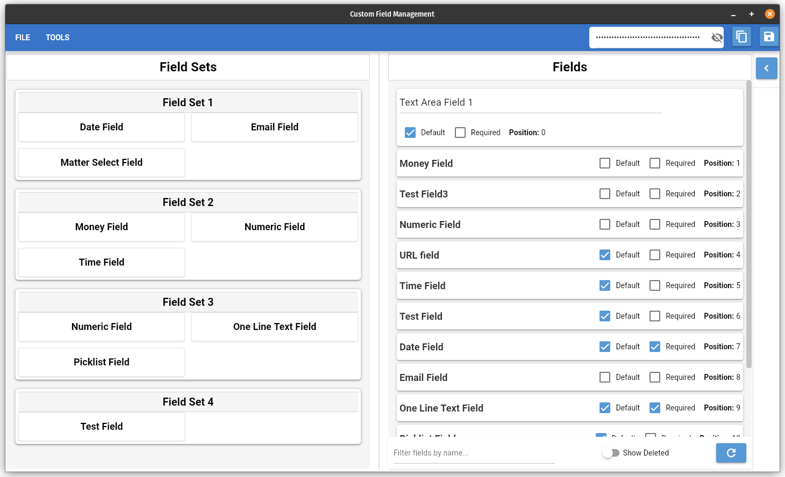

This is a **locally run web-based application** built with [NiceGUI](https://github.com/zauberzeug/nicegui) to manage **Customfields** and **Customfield Sets**.

## Interface Interactions:
- Esc: Clear selected fields
- Ctrl+d: Toggle deleted field visibility
- Double click to edit field names
- Checkboxes update on click
- **Key Modifiers**: Ctrl and Shift
    - Can be used together while selecting fields
    - Selection based on last field clicked

    

Check the development branch for updates 