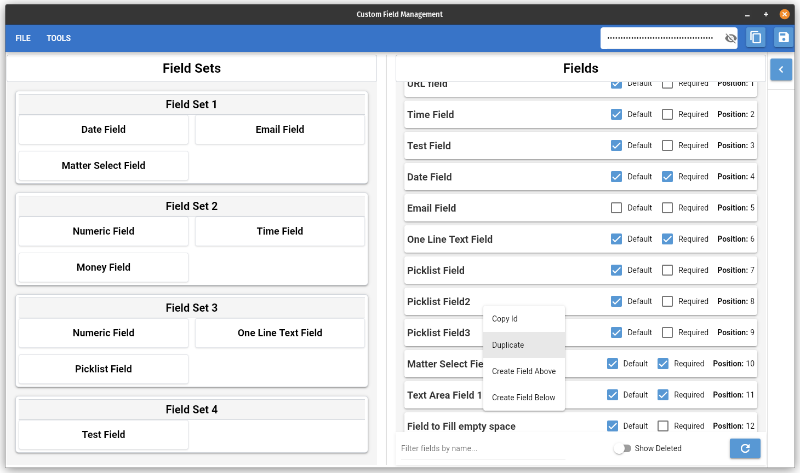

This is a **locally run web-based application** built with [NiceGUI](https://github.com/zauberzeug/nicegui) to manage **Customfields** and **Customfield Sets**.

## Interface Interactions:
- Esc: Clear selected fields
- Ctrl+d: Toggle deleted field visibility
- Double click to edit field names
- Checkboxes update on click
- **Key Modifiers**: Ctrl and Shift
    - Can be used together while selecting fields
    - Selection based on last field clicked
- F2: Toggle editing field name when selected
- Ctrl+n: Create new custom field
- **Right click fields**:
    - Move selected fields by right clicking a target field and choose to insert above or below
    - Duplicate fields
    - Create new field above
    - Create new field below

## API Client
- Seems to be keeping up with all the changes made to the api recently.
- Models that load by default when initializing the submodule have not been updated but work fine

## Issues:
- **Running in native mode:**
    - If there are any dependency issues when running, run in a browser by removing the "native=True" in the very last line of app.py
    - native mode seems to run fine on windows, by there may be issues with pywebview on certain linux systems

## Quickly edit field names

## Duplicate Field

